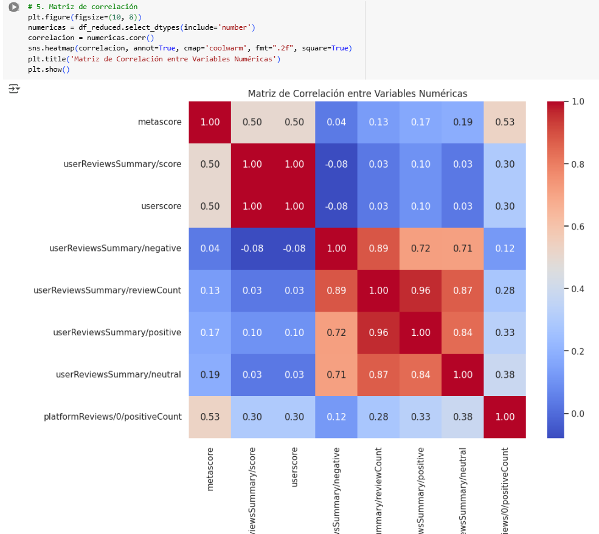
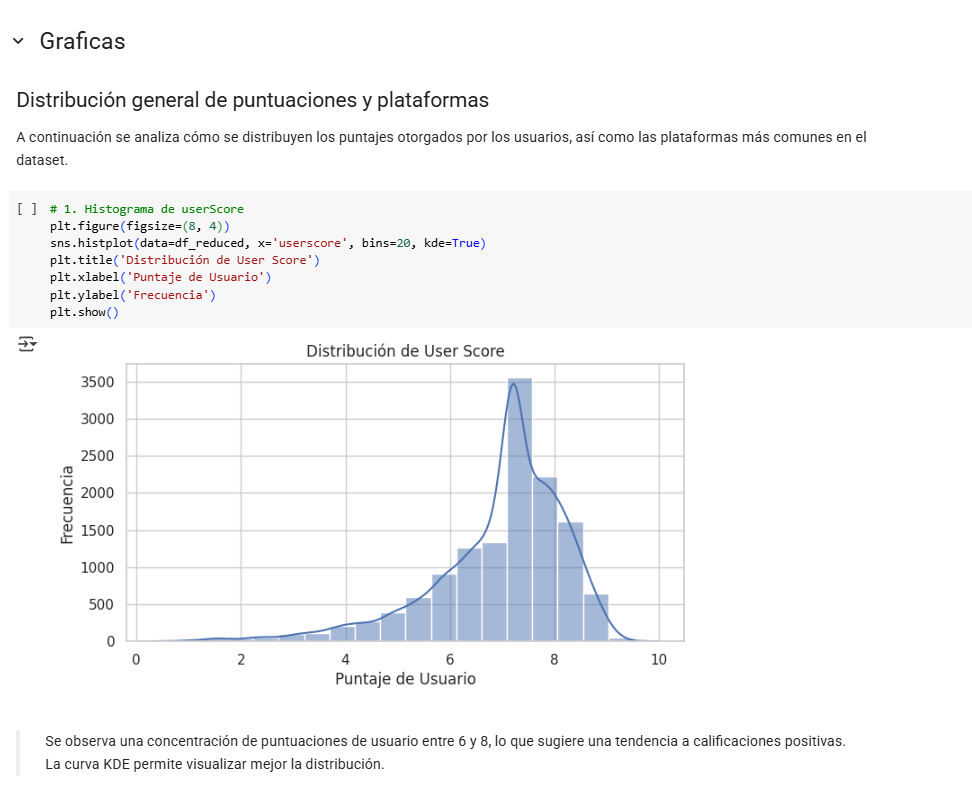
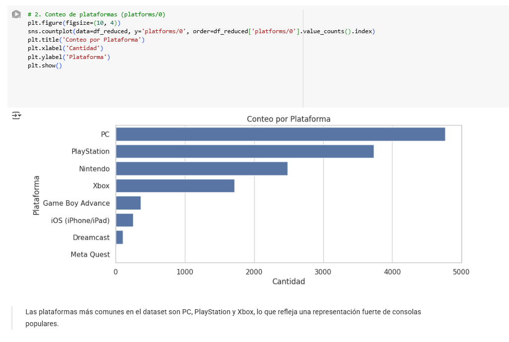
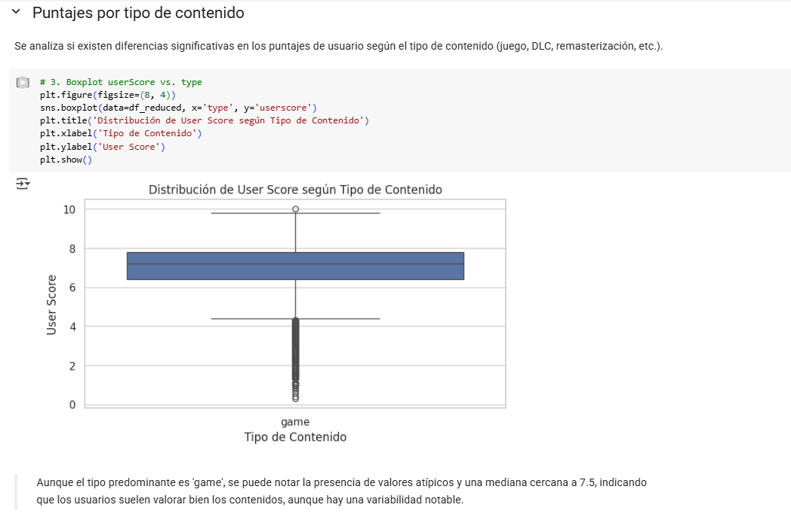

# ds-i-metacritic · EDA de Videojuegos (Metacritic)

Análisis exploratorio para entender cómo varían las puntuaciones de **usuarios** y **críticos**, y qué patrones aparecen por plataforma, género y año.  
Primer proyecto del portfolio de Data Science (curso DS I).

[](https://colab.research.google.com/drive/1G7AOSqC__0ZdLgQukFz7aPO9bBeicFIV)

---


## 🔍 Highlights en una mirada

<p align="center">
  
  
</p>
<p align="center">
  <em>Izq: correlaciones entre variables clave. Der: distribución de userScore.</em>
</p>

<p align="center">
  
  
</p>
<p align="center">
  <em>Izq: representación por plataforma. Der: diferencias de userScore por plataforma.</em>
</p>

---

## 📁 Notebook
- Colab (completo): **[abrir](https://colab.research.google.com/drive/1G7AOSqC__0ZdLgQukFz7aPO9bBeicFIV)**
- Carpeta con notebooks: [`./notebooks/`](./notebooks/)

## Objetivos

- Explorar la distribución de **userScore** y **metascore**.  
- Detectar correlaciones entre métricas de reseñas.  
- Observar diferencias por **plataforma/género** y su posible impacto.  
- Dejar bases para un futuro modelo (clasificación/regresión simple).

---

## 📁 Estructura rápida
- `notebooks/` → notebook principal (EDA + primeros modelos).
- `data/` → `dataset_metacritic_2025.csv` (limpiado para uso educativo).
- `figures/` → imágenes usadas en este README.

---


## 🗂️ Dataset
- **Fuente:** compendio público (curado para el curso).
- **Tamaño:** ~13.4k juegos, ~20 variables clave.
- **Campos principales:** `title`, `platform`, `genres`, `metascore`, `userScore`, recuentos de reseñas por tipo, año de lanzamiento.


> El dataset fue limpiado para uso educativo.

---

## ✨ Hallazgos (highlights)
- **Distribuciones:** `userScore` concentra valores altos (≈7–8), con cierta asimetría.
- **Correlaciones:** fuertes relaciones entre reseñas positivas/negativas/neutral (consistentes entre sí).
- **Plataformas/géneros:** algunas plataformas concentran más títulos con puntajes altos (posible sesgo de catálogo/audiencia).
- **Usuarios vs críticos:** correlación moderada; no siempre coinciden (*útil para producto/marketing*).

---

## 🤖 Modelado (baseline rápido)
> **Objetivo:** predecir `userScore` (0–10) a partir de plataforma, género, reseñas y metadatos numéricos.

Modelos probados:
- `LinearRegression`, `RandomForestRegressor`, `KNeighborsRegressor`,  
  `DecisionTreeRegressor`, `GradientBoostingRegressor`, `XGBRegressor`.

**Validación:** `cross_val_score` (cv=5, métrica R²).  
> Nota: los resultados iniciales son altos; en próximas iteraciones se reforzará el control de **data leakage** (codificación/selección de features y separación temporal).

**Próximos pasos de ML**
- Ingeniería de features (año → década, géneros one-hot, bins de metascore).
- Pipeline con `ColumnTransformer` + `OneHotEncoder` + escalado solo donde aplique.
- Métricas adicionales: MAE/RMSE y curva de residuos por modelo.
- Exportar 2–3 figuras de modelos (ej.: `real_vs_pred`, `residuos_rf`, `cv_boxplot`) a `figures/` y agregarlas arriba.

---

## Cómo ejecutar

```bash
pip install -U pandas numpy matplotlib seaborn
# abrir notebooks/ProyectoDS1ParteIII...ipynb
o Colab desde el badge de arriba.
```
---

## Licencia

MIT – uso libre con atribución.

## Contacto

Cristian Emanuel Campos Fuentes – cristianemanuelcamposfuentes@hotmail.com
 – [LinkedIn](https://www.linkedin.com/in/cristian-emanuel-campos-fuentes/)
